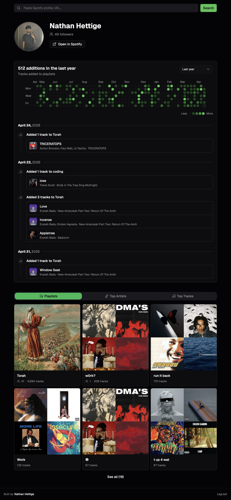

# Spotify Contributions

A GitHub-contributions-style heatmap for your Spotify playlist activity. See when and what tracks you or any user added to playlists, visualized as a daily activity grid.



## Features

- Activity heatmap showing tracks added to playlists per day
- Click any day to see a timeline of added tracks, grouped by playlist
- Browse your playlists, top artists, and top tracks
- Search and view any Spotify user's public playlist contributions

## Access

This app uses the Spotify Developer API, which operates in development mode and only allows pre-approved users to log in. If you'd like access, reach out and I can add you.

## Development

```bash
pnpm install
pnpm dev
```
